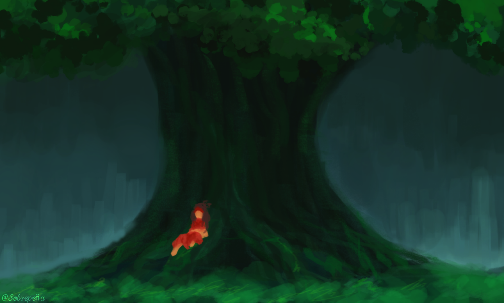

# Team Hiraya Studio Website 🌟

A mystical and enchanting website for Team Hiraya Studio, featuring a magical sidebar navigation and cosmic background effects that perfectly capture the spirit of "Hiraya" - the fruit of hopes and dreams.


## ✨ Features

- **Magical Sidebar Navigation** - Beautiful sliding sidebar with animated links and icons
- **Cosmic Background Effects** - Animated particles, floating orbs, and glowing effects
- **Full Responsive Design** - Perfect experience on desktop and mobile devices
- **Smooth Animations** - Gentle transitions and hover effects throughout
- **Mystical Theme** - Captures the enchanting "Hiraya" spirit

## 🚀 Quick Start

1. **Clone or download** the repository
2. **Update file paths** for your images and links in `index.html`:
   ```html
   
   <a href="About_Us/AboutUs.html">About Us</a>
   ```
3. **Open `index.html`** in your web browser

## 📁 Project Structure

```
team-hiraya-website/
│
├── index.html                 # Main website file
├── Engkanto/                  # Game assets folder
│   ├── Raya.png
│   ├── ConceptArt.png
│   └── android-chrome-192x192.png
├── About_Us/                  # About page folder
│   └── AboutUs.html
└── README.md
```

## 🎨 Customization

### Colors & Theme
The website uses a magical color scheme. Modify in CSS:

```css
/* Main magical colors */
--primary-blue: #7a9eff;      /* Sidebar highlights */
--magenta-purple: #c878ff;    /* Accent colors */
--cyan-blue: #64dcff;         /* Glow effects */
--dark-bg: #0a0a1a;          /* Deep space background */
```

### Sidebar Content
Edit navigation structure in HTML:

```html
<div class="nav-section">
    <h3>Your Section</h3>
    <ul class="nav-links">
        <li><a href="link.html"><span class="nav-icon">🎯</span> Your Link</a></li>
    </ul>
</div>
```

## 📱 Mobile Features

- **Hamburger Menu** (☰) - Tap to open sidebar
- **Overlay Background** - Dark overlay behind sidebar
- **Auto-close Functionality** - Closes when tapping outside or selecting links
- **Responsive Layout** - Adapts to all screen sizes

## 🛠️ Technologies Used

- **HTML5** - Semantic structure
- **CSS3** - Advanced animations and gradients
- **JavaScript** - Mobile navigation functionality
- **CSS Grid & Flexbox** - Modern layout techniques

## 🌌 Team Hiraya

**Team Hiraya** is a small indie team driven by imagination and purpose — creating games, animation, art, and more. Rooted in the Filipino meaning of *Hiraya* ("the fruit of one's hopes and dreams"), our work reflects a balance of vision, discipline, and respect.

### Current Project: ENGKANTO 🎮
A 2D action-adventure game inspired by Filipino mythology, featuring:
- Exploration-based gameplay
- Filipino mythological creatures
- Cultural storytelling
- Fast-paced combat system

## 🎯 Navigation Sections

- **Home** - Welcome and team introduction
- **About Us** - Team story and vision
- **Engkanto** - Main game project details
- **Art Gallery** - Visual assets and concept art
- **Resources** - Documentation and downloads

## 📞 Connect With Us

We'd love to hear from you! Feel free to:
- Explore our projects
- Check out our artwork
- Learn about Filipino mythology through our games

---

<div align="center">

*"Where creativity grows, ideas take shape, and dreams find their form."* ✨

**© 2025 Team Hiraya. All rights reserved.**

</div>
